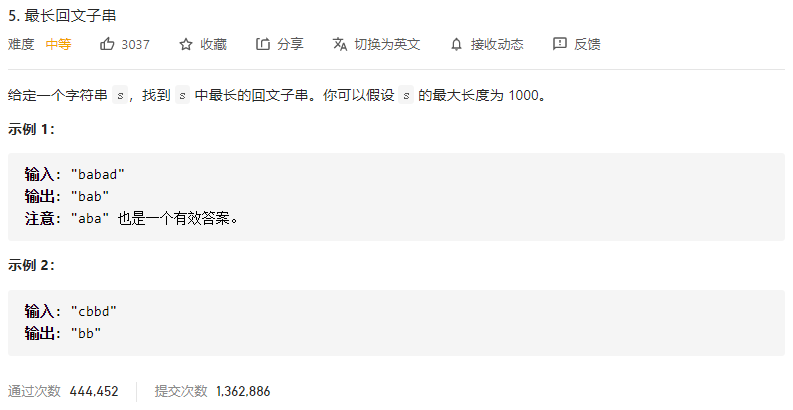
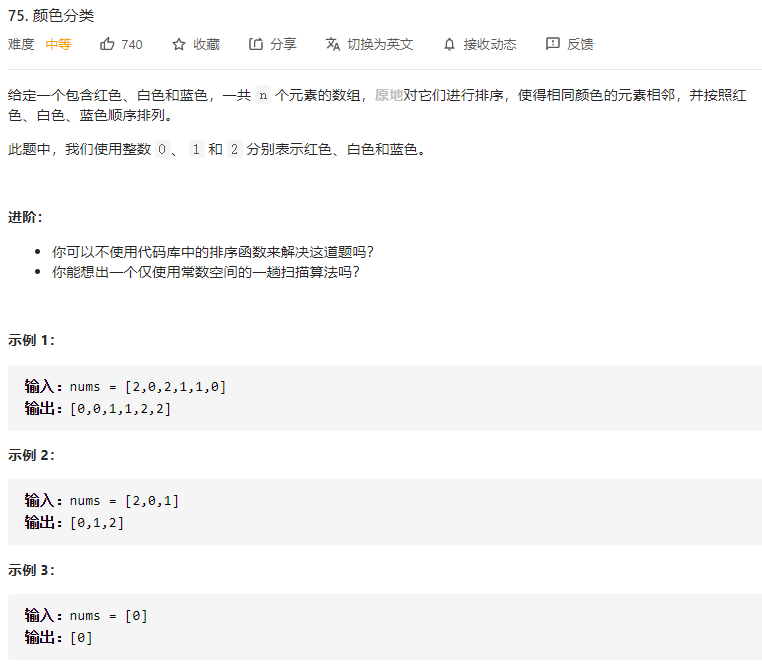
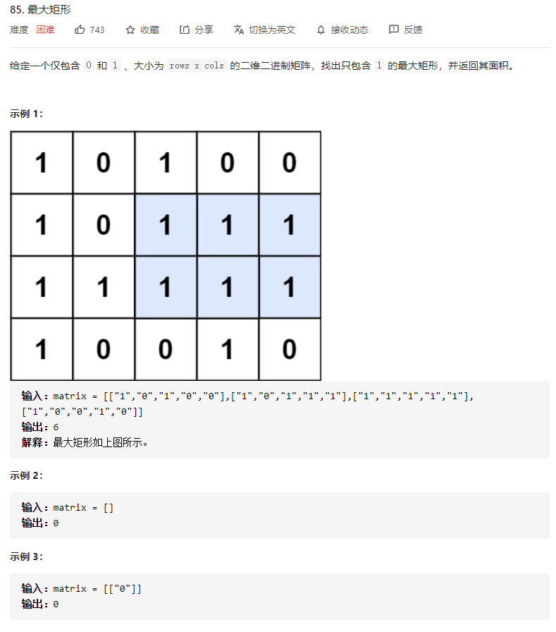

#  动态规划

## [152. 乘积最大子数组](https://leetcode-cn.com/problems/maximum-product-subarray/)


# 回溯

## [17. 电话号码的字母组合](https://leetcode-cn.com/problems/letter-combinations-of-a-phone-number/)


# 回文字符串

### **[5. 最长回文子串](https://leetcode-cn.com/problems/longest-palindromic-substring/)**



```java
class Solution {
    public String longestPalindrome(String s) {
        int n = s.length();
        boolean[][] dp = new boolean[n][n];
        String ans = "";
        //控制长度
        for (int l = 0; l < n; ++l) {
            //i:起始位置，j:末尾位置
            for (int i = 0; i + l < n; ++i) {
                int j = i + l;
                if (l == 0) { //与自己比较
                    dp[i][j] = true;
                } else if (l == 1) { //当长度为1时
                    dp[i][j] = (s.charAt(i) == s.charAt(j));
                } else { // 当长度>2时，使用状态转移方程
                    dp[i][j] = (s.charAt(i) == s.charAt(j) && dp[i + 1][j - 1]);
                }
                if (dp[i][j] && l + 1 > ans.length()) {
                    ans = s.substring(i, i + l + 1);
                }
            }
        }
        return ans;
    }
}
```


# 贪心

##   [55. 跳跃游戏](https://leetcode-cn.com/problems/jump-game/)

 


# 排序

## 指针

### [16. 最接近的三数之和](https://leetcode-cn.com/problems/3sum-closest/)


### 11. [盛最多水的容器](https://leetcode-cn.com/problems/container-with-most-water/)


### [75. 颜色分类](https://leetcode-cn.com/problems/sort-colors/)



# 其他

#### [581. 最短无序连续子数组](https://leetcode-cn.com/problems/shortest-unsorted-continuous-subarray/)


#### [85. 最大矩形](https://leetcode-cn.com/problems/maximal-rectangle/)



方法一: **使用柱状图的优化暴力方法**

- 时间复杂度：O(m^2n)*O*(*m*2*n*)
-  空间复杂度：O(mn)*O*(*m**n*) 

```java
class Solution {
    public int maximalRectangle(char[][] matrix) {
        int m = matrix.length;
        if (m == 0) {
            return 0;
        }
        int n = matrix[0].length;
        int[][] left = new int[m][n];

        for (int i = 0; i < m; i++) {
            for (int j = 0; j < n; j++) {
                if (matrix[i][j] == '1') {
                    left[i][j] = (j == 0 ? 0 : left[i][j - 1]) + 1;
                }
            }
        }

        int ret = 0;
        for (int i = 0; i < m; i++) {
            for (int j = 0; j < n; j++) {
                if (matrix[i][j] == '0') {
                    continue;
                }
                int width = left[i][j];
                int area = width;
                for (int k = i - 1; k >= 0; k--) {
                    width = Math.min(width, left[k][j]);
                    area = Math.max(area, (i - k + 1) * width);
                }
                ret = Math.max(ret, area);
            }
        }
        return ret;
    }
}
```


