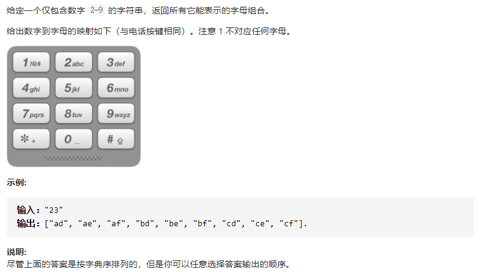
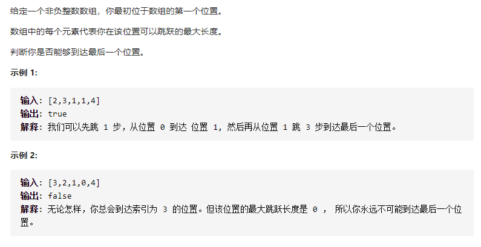

#  动态规划

## [152. 乘积最大子数组](https://leetcode-cn.com/problems/maximum-product-subarray/)

# 回溯

## [17. 电话号码的字母组合](https://leetcode-cn.com/problems/letter-combinations-of-a-phone-number/)

# 贪心

##   [55. 跳跃游戏](https://leetcode-cn.com/problems/jump-game/)

 

# 双指针

## [16. 最接近的三数之和](https://leetcode-cn.com/problems/3sum-closest/)

## [11. 盛最多水的容器](https://leetcode-cn.com/problems/container-with-most-water/)

# 其他

#### [581. 最短无序连续子数组](https://leetcode-cn.com/problems/shortest-unsorted-continuous-subarray/)

